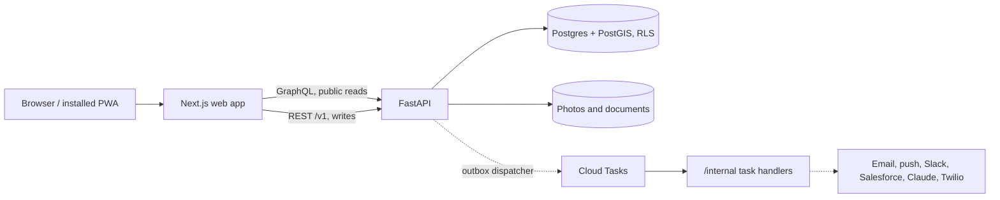

# Cornerpin

A multi-tenant PWA where land owners and developers list subdivision lots and buyers browse
them on a map. Named for the survey pins that mark a lot's corners.

> **Status: Phase 1 in progress.** The scaffold (task P1-01) is in place: an API that answers
> a health check and an empty web shell. Unless a section says otherwise, everything below
> describes what is being built, not what exists.

## What it does

**For owners**

- Manage subdivisions, phases and lots from an owner portal.
- Set each lot's status (available, on hold, sold) and price, with a history of who changed
  what and when.
- Upload photos and documents: plat, survey, covenants, utilities.
- Draw lot boundaries on the map or import them as GeoJSON.
- Print a QR sign for each lot. The code is a stable redirect, so a printed sign survives a
  rename.

**For buyers**

- A public page per subdivision with a map coloured by lot status, a lot list and filters.
- A page per lot with price, status, photos, documents and a directions link. A lot is either
  land-only or lot + home.
- Sign up without a password, save lots, and get an email when a saved lot's status or price
  changes. Web push is offered to people who install the app.
- Send an inquiry or request a hold, which the owner approves. No money moves online in v1.

**On site**

Buyers will often open a lot page from a QR code on a sign, with weak signal. The app is
installable, precaches a subdivision's lot summaries on first visit, serves previously viewed
lots and photos offline, and queues an inquiry until the connection returns.

The first tenant is a real subdivision in Idaho. A separate demo tenant on synthetic data
exercises the integrations and the AI features that the real tenant does not need.

## Architecture



- **Tenancy by row-level security.** A tenant is an owner organization. Every tenant-owned
  table has RLS enabled and forced. The API connects as a non-owner role and sets the tenant
  and user per transaction from the verified session, never from the client.
- **REST for writes, GraphQL for public reads.** The owner portal, forms and webhooks use REST
  with an OpenAPI schema. Public browsing uses read-only GraphQL so responses can be cached.
- **Transactional outbox.** A state change writes an outbox row in the same transaction.
  Notifications, integrations, outreach and scoring run from there as background tasks, so no
  third-party or model call happens during a request.
- **Modular monolith.** `listings`, `leads`, `notifications`, `outreach`, `decisioning` and
  `integrations` are modules in one API container, talking through function interfaces and
  the outbox.
- **Passwordless auth.** Magic link and Google sign-in, httpOnly session cookies, Cloudflare
  Turnstile on public forms.
- **Private data stays out of the cache.** The service worker never caches authenticated or
  owner-portal responses.
- **Typed end to end.** Pydantic to OpenAPI to generated TypeScript types, plus GraphQL
  codegen.

The reasoning behind each of these is in the [architecture decision records](docs/adr/README.md).

## Stack

| Layer | Choice |
| --- | --- |
| API | Python, FastAPI, Pydantic, SQLAlchemy 2, GeoAlchemy2, Alembic, Strawberry GraphQL |
| Database | Postgres + PostGIS with row-level security |
| Web | Next.js (App Router, TypeScript), Tailwind, shadcn/ui, MapLibre GL, Serwist |
| Background work | Transactional outbox, Cloud Tasks |
| Hosting | Cloud Run, Neon, Cloud Storage, Terraform, GitHub Actions |
| Testing | pytest, Vitest, Playwright, an eval suite for the outreach agent |
| Tooling | uv, ruff, pyright, pnpm |

## Roadmap

Each phase ends at a gate that a real user has to be able to pass on the production URL. The
next phase does not start until then.

| Phase | Delivers | Gate |
| --- | --- | --- |
| 1 Listings | Tenants, lots, map, photos, public pages, sign-up, notifications, PWA, live deploy | Scan a lot sign, install the app, save a lot and get an email when the owner marks it sold |
| 2 Leads + outreach | Lead pipeline, outreach agent (email, then SMS), evals, Slack, Salesforce | Opt in on the demo tenant and be followed up by the agent, with the lead showing in Slack and Salesforce |
| 3 Risk + warehouse | Snowflake events, lead and deal score, financing demo module, owner dashboard | See a scored lead with reason codes, and walk a synthetic financing application to a logged decision |
| 4 Voice + reach | Voice outreach, Zoom tours, Gmail threads, MCP server | Book a Zoom tour from a lot page, and ask Claude about availability through MCP |

Two rules shape the later phases:

- **Outreach is consent-first.** The agent sends nothing on a channel without recorded consent
  for that channel, checks opt-outs before every send, respects quiet hours in the recipient's
  time zone, and logs every send. It acts only through its tools, states only facts it read
  through them, and hands off to a human when unsure.
- **Risk scores are advisory.** Every score is stored with its model version, inputs and
  reason codes, and a human makes the decision. No protected-class attributes or proxies are
  used as features. The financing module exists only in the demo tenant, on synthetic data.

Task-level detail is in [docs/IMPLEMENTATION_PLAN.md](docs/IMPLEMENTATION_PLAN.md).

## Repository layout

`apps/api` and `apps/web` exist today. The rest arrives with the tasks that build it.

```
apps/api    FastAPI: REST /v1, GraphQL /graphql, webhooks, /internal task handlers
apps/web    Next.js PWA
apps/mcp    MCP server over the same tools the outreach agent uses (Phase 4)
evals/      scripted conversations and checks for the outreach agent
infra/      Terraform for Cloud Run, Cloud Tasks, Cloud Storage, secrets
docs/       plan and supporting docs
```

## Local development

Everything runs on the dev machine first: Postgres + PostGIS and Mailpit in Docker, the API
via uvicorn, the web app via `next dev`.

Prerequisites: Docker Desktop, Node 24, pnpm, Python 3.13 and uv.

```bash
cp .env.example .env            # local settings; never committed
uv sync                         # Python dependencies
pnpm install                    # web dependencies
docker compose up -d            # Postgres + PostGIS on port 5434, Mailpit on 1025/8025
uv run alembic upgrade head     # apply migrations
uv run python -m cornerpin.seed # demo tenant with a synthetic subdivision
uv run pytest                   # API and RLS tests
uv run ruff check
uv run pyright
pnpm lint
pnpm test
pnpm build
pnpm e2e                        # Playwright; needs docker compose up; first run: pnpm --filter web exec playwright install chromium
pnpm gen:api                    # regenerate TypeScript types after changing the API
```

To run the apps:

```bash
uv run uvicorn cornerpin.main:app --reload    # API at http://localhost:8000
pnpm --filter web dev                         # web at http://localhost:3300
```

Mailpit's inbox is at http://localhost:8025. To sign in locally, open http://localhost:3300/signin
and use `owner@demo.cornerpin.test` (the seeded demo owner); the link arrives in Mailpit.

Locally, Mailpit receives the magic-link emails and Turnstile uses Cloudflare's always-pass
test keys. Integrations that need a third-party account sit behind config and stay dormant
until their credentials exist.

Production will be Cloud Run, Neon and Cloud Storage at `cornerpin.app`, deployed at the end
of Phase 1. It is not live yet.

## Documentation

- [docs/IMPLEMENTATION_PLAN.md](docs/IMPLEMENTATION_PLAN.md): phases, tasks, data model, PWA
  behaviour and expected running costs.
- [docs/adr/](docs/adr/README.md): architecture decision records, one file per decision.
- [CLAUDE.md](CLAUDE.md): working rules for Claude Code in this repo.
